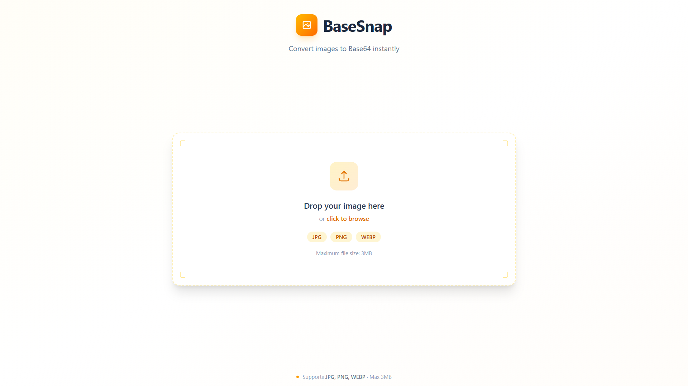

# ⚡ BaseSnap — Image to Base64 Converter

A modern React TypeScript based web app to convert images into Base64 instantly, with drag-and-drop support, format validation, and fast performance — all wrapped in a sleek dark theme.

---

## 📸 Preview

---

## 🚀 Features

- ⚡ Instant image to Base64 conversion
- 🖱️ Drag & drop upload with visual feedback
- 📂 Click-to-upload fallback (file picker)
- 🖼️ Supports JPG, PNG, and WebP formats
- ✅ File type validation
- 📋 Copy Base64 string with one click
- 🌑 Pure dark theme with amber accents
- 🎨 Clean and modern UI
- 📱 Fully responsive design
- ⚙️ Built with performance in mind

---

## 🛠️ Tech Stack

- **React**
- **TypeScript**
- **Vite**
- **Tailwind CSS**
- **Framer Motion**